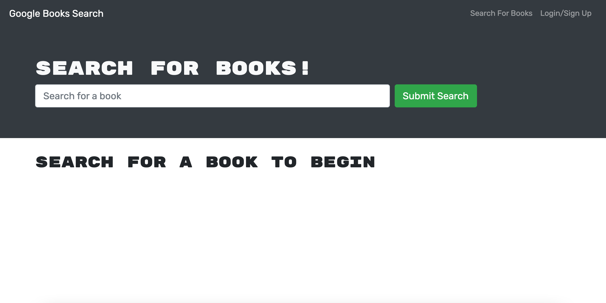
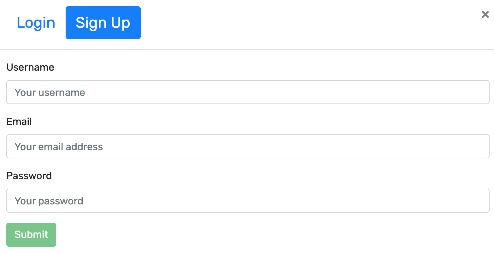
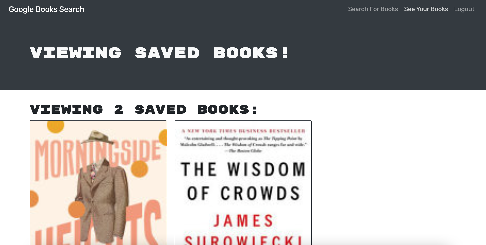

# Book Search 
## Description 
Book Search is an online book searcher that helps users find and save books they would like to read. 
## Deployed app
Deployed with Heroku 
https://frozen-crag-06885.herokuapp.com/ 
## Table of Contents 
* [Home](#home) 
* [User](#user) 
* [Technology](#technology) 
* [Questions](#questions) 
## Home 
Viewing the site will land you on a homepage where users can search for any books that are currently in the google books API. Users do not have to be logged in to search for books but must be logged in if they wish to save their own personal books. 

Home Page 
 

## User 
In the top right of the page, users can sign up with a username, email, and password or if they already have an account they can login using their email and password. 

Signup and Login 
 

Profile Page 
If a user is signed in they have the ability to save searched books. They are then saved and displayed onto a profile page that can be accessed through the navigation bar at the top for signed in users. If a user wishes to remove a book from their collection they have that functionality as well. 

Saved Books Page 
 

## Technology 
React 
Javascript 
CSS 
HTML 
Heroku 
NPM 
Bootstrap 
React Router 
Apollo 
Concurrently 
Bcrypt 
Graphql 
Mongoose 
Express 
Jsonwebtoken 

## Questions 
GitHub: https://github.com/adambedingfield 
Email: adamcbedingfield@gmail.com 